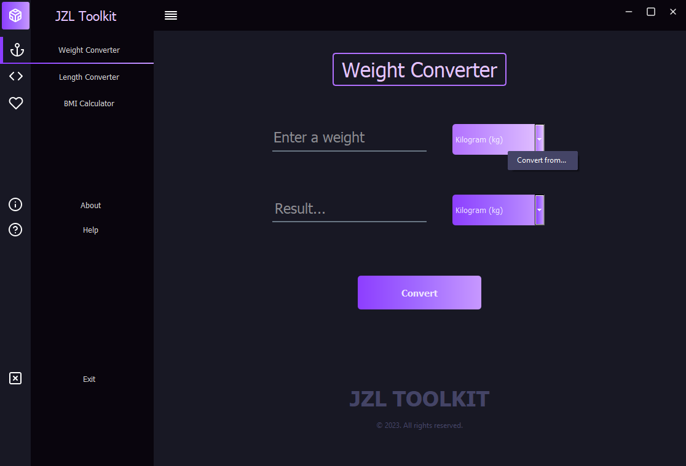
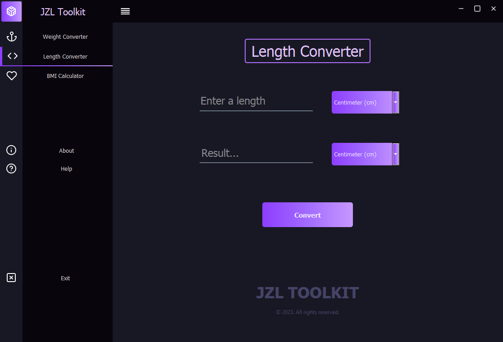
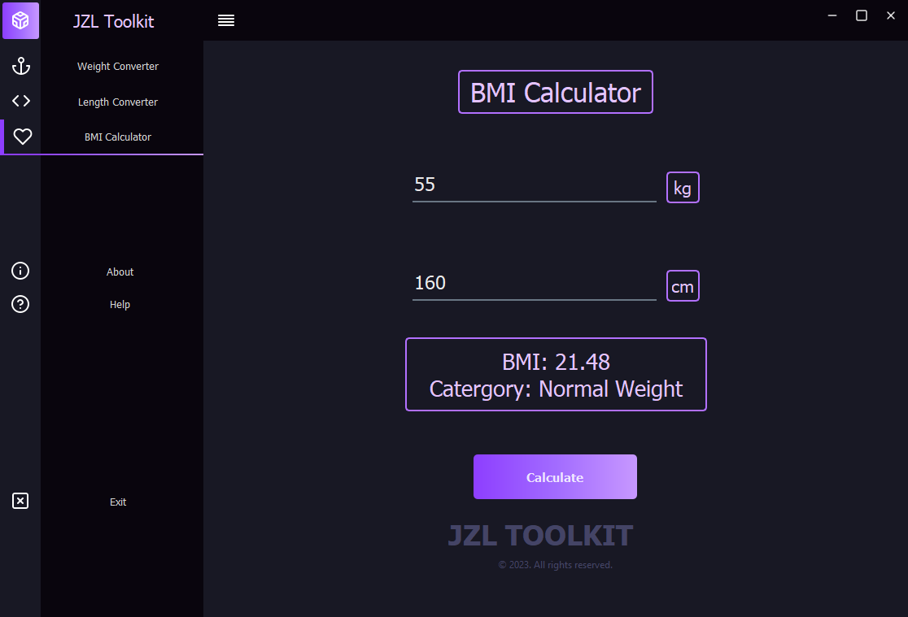
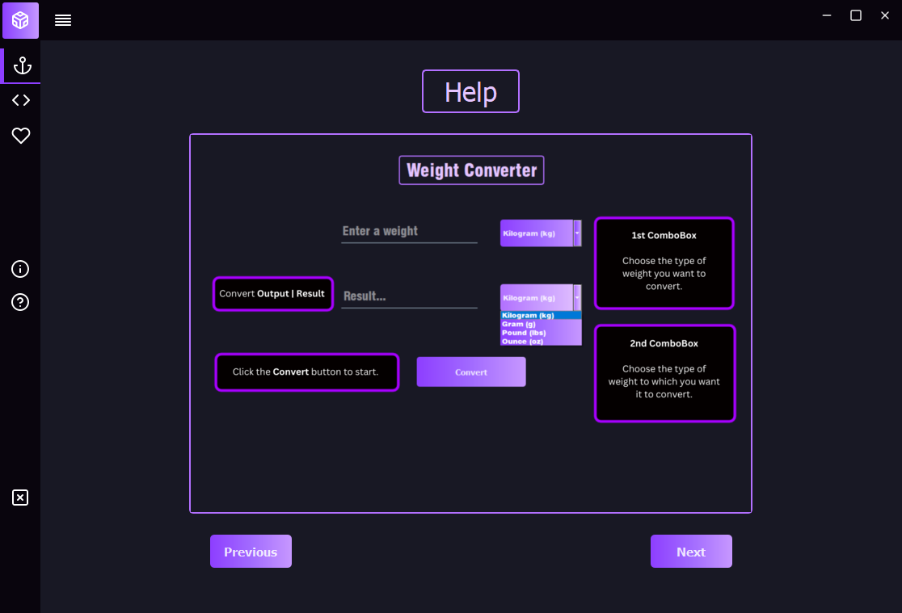

# Weight & Length Unit Converter + BMI Calculator (PyQt5 GUI)

A simple and intuitive desktop application built using **Python** and **PyQt5** that allows users to:

- Convert **weight units**: kilograms (kg), grams (g), pounds (lbs), ounces (oz)
- Convert **length units**: centimeters (cm), meters (m), kilometers (km), inches (in), feet (ft)
- Calculate **Body Mass Index (BMI)** with easy input fields

This project showcases GUI development using **PyQt5 Designer** and Python logic integration.

---

## 📦 Features

- 🧮 Real-time unit conversion
- 📏 Converts both metric and imperial units
- ⚖️ BMI calculator with category interpretation (Underweight, Normal, Overweight, etc.)
- 💻 Simple and responsive GUI interface
- 🧠 Error handling for invalid inputs

---

## 📸 Screenshots

Here are some screenshots showcasing the application's functionality and interface:

### 🧮 Main Converter Window (Weight Conversion)



### ⚖️ Length Conversion



### 🧠 BMI Calculator



### 🆘 Help Page



---

## 🛠️ Technologies Used

- Python 3
- PyQt5 (with Qt Designer)
- Object-Oriented Programming (OOP) principles
- Signal-slot mechanism in Qt for responsive UI

---

## 🚀 How to Run

1. **Clone the Repository**

```bash
git clone https://github.com/andreicsl/pyqt5-toolkit-converter.git
cd pyqt5-toolkit-converter/project
```

2. **Install Requirements**

```bash
pip install PyQt5
```

3. **Run the Application**

```bash
python main.py
```

---

## 📚 What I Learned

- Designing user interfaces with **Qt Designer** and integrating it into Python
- Handling **unit conversion logic** efficiently
- Implementing **BMI formulas** and basic health indicators
- Using **PyQt5 widgets** like combo boxes, input fields, labels, and buttons
- Managing application flow using **event-driven programming**
- Structuring a Python project with clear separation between UI and logic

---

## 📄 License

This project is open-source and available under the [MIT License](LICENSE).

---

## Author

Created by [@andreicsl](https://github.com/andreicsl)
For inquiries or collaborations, reach out via [jelomarkandrei@gmail.com] or check out my other projects on [GitHub](https://github.com/andreicsl).
